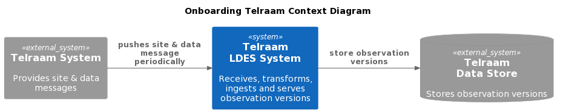
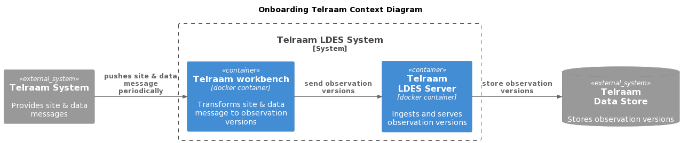
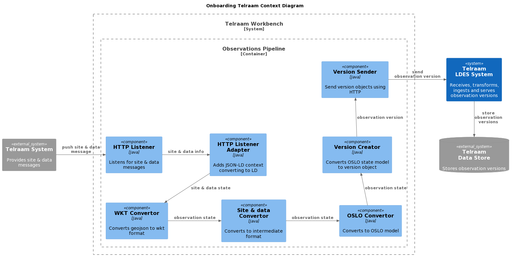

# VSDS-Onboarding-Telraam
All things related to onboarding Telraam in the VSDS.

> **Status**: DONE

> **Deployment Notes**
>   * customize metadata: title, description, license, contact info, ...
>   * set seed environment variables before seeding: LDES_SERVER_BASE, LDES_SERVER_ADMIN_BASE, LDES_SERVER_CURL_CUSTOM_HEADER, ...
>   * protect swagger UI (not yet done in terraform)
>   * tracing (push driven, for now) is off by default: requires jaeger
>   * protect metrics endpoints (/actuator/prometheus)
>   * tune retention, compaction & deletion cron jobs: currently yearly beginning of November

## Analysis
[Telraam](https://telraam.net/en/what-is-telraam) is a network of private and public individuals and companies continuously measuring local traffic using devices attached on the inside of a window.

* A Telraam **sensor** measures local traffic data.
* An **observation** is a measurement and calculation of various aggregated anonymous data such as average speed and vehicle counts. 

## Requirements
Telraam provides the sensors and observations as an API call containing hourly aggregated data and wants to expose one linked data event streams (LDES) from this data. In order to do so, we need to ingest the combined sensor and observation information (state objects) and create observation versions (version objects).

MUST, SHOULD and MAY keywords are used as defined by [rfc2119](https://www.rfc-editor.org/rfc/rfc2119).

* MUST accept a message containing observation data
* MUST translate the observation data information to an intermediate observation model to allow for the OSLO model to evolve
* MUST translate the intermediate observation model to the current OSLO traffic model
* MUST convert the OSLO traffic model to its version object
* MUST provide an LDES for the OSLO traffic model version objects
* MUST use namespace prefix `https://data.vlaanderen.be/ns/verkeersmetingen#` or `https://implementatie.data.vlaanderen.be/ns/vsds-verkeersmetingen#`
* MUST identify observations as `https://telraam.net/en/location/{segment_id}#{observation_type}` where `{segment_id}` is the road segment ID and `{observation_type}` is the type of observation (based on the measured properties: `bike`, `car`, `heavy`, `pedestrian` & `v85`)
* MUST version observations as `https://telraam.net/en/location/{segment_id}#{observation_type}-{timestamp}` where `{timestamp}` is an ISO8601 time
* MUST map observation to `:Observation` as an intermediate type where `:` is `https://telraam.net/ns/traffic#` before converting to its OSLO model

## Architecture
To allow Telraam to publish the LDES we use a ([LDIO](https://github.com/Informatievlaanderen/VSDS-Linked-Data-Interactions)) workbench to transform the [original message](./examples/traffic.json) containing Telraam specific models to linked data version objects according to OSLO models. These models are then send to a [LDES Server](https://github.com/Informatievlaanderen/VSDS-LDESServer4J) to ingest, store (using a MongoDB), fragment and serve these version objects.

In the [workbench](./implementation/workbench/config.yml) we create a pipeline to handle the transformation observation data information. The pipeline accepts a custom HTTP message containing this information in [JSON](https://www.json.org/) format so we transform it to linked data by adding a [JSON-LD context](https://json-ld.org/). The message contains geospatial information in [geojson-ld](https://geojson.org/geojson-ld/) format which is not very suitable for futher processing so this format is converted to [Well Known Text (WKT)](https://en.wikipedia.org/wiki/Well-known_text_representation_of_geometry) format. After that we convert to an intermediate model adding identifiers and types, convert to OSLO model, create an object version and finally send to the LDES Server.

The steps in the pipeline are (all [LDIO components](https://informatievlaanderen.github.io/VSDS-Linked-Data-Interactions/) can be found in namespace `be.vlaanderen.informatievlaanderen.ldes.ldio`):
* listen for observations message ([LdioHttpIn](https://informatievlaanderen.github.io/VSDS-Linked-Data-Interactions/ldio/ldio-inputs/ldio-http-in))
* add [json-ld context](./implementation/workbench/jsonld/traffic.jsonld) to convert to linked data ([JsonToLdAdapter](https://informatievlaanderen.github.io/VSDS-Linked-Data-Interactions/ldio/ldio-adapters/ldio-json-to-json-ld))
* convert geojson to wkt format ([GeoJsonToWktTransformer](https://informatievlaanderen.github.io/VSDS-Linked-Data-Interactions/ldio/ldio-transformers/ldio-geojson-to-wkt))
* convert to intermediate format using [traffic.to-observation.rq](./implementation/workbench/sparql/traffic.to-observation.rq) ([SparqlConstructTransformer](https://informatievlaanderen.github.io/VSDS-Linked-Data-Interactions/ldio/ldio-transformers/ldio-sparql-construct))
* convert to OSLO model using [observation.to-oslo.rq](./implementation/workbench/sparql/observation.to-oslo.rq) ([SparqlConstructTransformer](https://informatievlaanderen.github.io/VSDS-Linked-Data-Interactions/ldio/ldio-transformers/ldio-sparql-construct))
* create version object ([VersionObjectCreator](https://informatievlaanderen.github.io/VSDS-Linked-Data-Interactions/ldio/ldio-transformers/ldio-version-object-creator))
* send to LDES Server ([LdioHttpOut](https://informatievlaanderen.github.io/VSDS-Linked-Data-Interactions/ldio/ldio-outputs/ldio-http-out))

> **Note**: see [below](#c4-diagrams) for C4 diagrams.

## Design
To map the observations, we use a two-step approach: convert the observations' message into an intermediary-linked data model and then transform this model to the correct OSLO model.

The [observations](./examples/traffic.json) message contains information about the measurement location and the aggregated data, including a timestamp. It is a JSON file containing the measurement locations as a geometry which defines the road segment on which the measurement took place. All geometries are in geojson format.

> **Note** that the members contain aggregated hourly data. We noticed that there are about 2K members per hour, which contain a non-empty property date and for which we can create a version object that the server can ingest. Based on this number, the LDES server ingests and keeps about 50K members daily or about 17-18M members yearly. In order to not keep the storage needs ever growing, we can set the retention to only keep the most recent members from the last 2 years (by default). Obviously, you can tune the value -- beforehand if no other view is defined without retention! -- to be any period required. See https://en.wikipedia.org/wiki/ISO_8601#Durations on how to specify the retention period value. 

### Conversion to Linked Data
To convert the observations message, we can add a custom JSON-LD context, including the current [geojson JSON-LD context](http://geojson.org/geojson-ld/geojson-context.jsonld) to ensure the geometries are converted to linked data. We define a default vocabulary (i.e. `@prefix : <https://telraam.net/ns/traffic#>`) so that the properties are correctly translated to predicates. We combine these definitions into a simple [JSON-LD context](./implementation/workbench/jsonld/traffic.jsonld).

In addition, as we prefer to work with WKT literals, we add a component to translate the geojson stucture to WKT literals.

### Conversion to Intermediate Model
Now that we have linked data we can split the message into individual observations and transform them to their intermediate model, adding identity and location information, as well as a fixed timestamp and a duration.

For the observation identity we use `https://telraam.net/en/location/{segment_id}` where `{segment_id}` is the road segment ID. In addition, we use the following mapping (for prefixes see the [mapping](./implementation/workbench/sparql/traffic.to-observation.rq)):

> **Note** that `a` is equivalent to `rdf:type` in all following mappings.

|observation|observation|
|-|-|
|N/A|**a :Observation**|
|locn:geometry {geometry}|**[a sf:MultiLineString; gsp:asWKT {geometry} ]**|
|geojson:properties / **:date** {date}|**:timestamp "{asISO8601Timestamp(date)}"^^xsd:dateTime**|
|geojson:properties / :timezone {timezone}|:timezone {timezone}|
|geojson:properties / :period {period}|:period {period}|
|geojson:properties / :period {period}|**:duration "{asDuration(period)}"^^xsd:duration**|
|geojson:properties / :uptime {uptime}|:uptime {uptime}|
|geojson:properties / :heavy {heavy}|:heavy {heavy}|
|geojson:properties / :car {car}|:car {car}|
|geojson:properties / :bike {bike}|:bike {bike}|
|geojson:properties / :pedestrian {pedestrian}|:pedestrian {pedestrian}|
|geojson:properties / :v85 {v85}|:v85 {v85}|

> **Notes**
> * We need to fix the XML timestamp as it contains a space between the date and time part while an ISO8601 timestamp contains the letter `T` instead.
> * We convert the period to a duration and add it as follows: the `hourly` period to a `PT1H` duration and the `daily` period to a `P1D` duration.
> * We add all other properties that have a value.

### Conversion to OSLO Model
Once we have identified our observations and added the required information, we can split the available count and speed values to individual observations and translate them to the correct type (a `https://implementatie.data.vlaanderen.be/ns/vsds-verkeersmetingen#Verkeerstelling` for counts, a `https://implementatie.data.vlaanderen.be/ns/vsds-verkeersmetingen#Verkeerssnelheidsmeting` for speed values) as defined by OSLO. To identify these observations we use the base identity from above (`https://telraam.net/en/location/{segment_id}` where `{segment_id}` is the road segment ID) and append the measurement type (`bike`, `car`, `heavy`, `pedestrian` & `v85`) resulting in identities like: `https://telraam.net/en/location/{segment_id}#{observation_type}`.

We then structure the observation a bit differently and use the following mapping (for prefixes see the [mapping](./implementation/workbench/sparql/observation.to-oslo.rq)):

|Telraam observation|OSLO observation|
|-|-|
|a :Observation|a **:Verkeersmeting**, |{observation_type != v85}|:**impl:Verkeerstelling**/|{observation_type == v85}|:**impl:Verkeerssnelheidsmeting**|
|tr:timestamp {timestamp}|iso19156-om:OM_Observation.phenomenonTime / time:hasBeginning / **time:inXSDDateTimeStamp** {timestamp}
|:duration {duration}|iso19156-om:OM_Observation.phenomenonTime / **time:hasXSDDuration** {duration}|
|{observation_type == v85}|:**iso19156-om:OM_Observation.result** {speed}|
|{observation_type != v85}|:**impl:Verkeerstelling.tellingresultaat** {count}|
|{observation_type == v85}|:geobserveerdKenmerk [a :Verkeerssnelheidsmetingkenmerk; impl:Verkeerssnelheidsmetingkenmerk.kenmerktype cl-vkt:V85; **:voertuigType cl-vrt:auto**]|
|{observation_type != v85}|:geobserveerdKenmerk [a :Verkeerskenmerk; impl:Verkeerstellingkenmerk.kenmerktype cl-vkt:aantal; **:voertuigType {map(observation_type)}**]|
|N/A|:geobserveerdObject / :bemonsterdObject / **dv-weg:rijrichting cl-trt:inDirection**|
|locn:geometry / geo:asWKT {geometry}|:geobserveerdObject / :bemonsterdObject / dv-netwerk:netwerkreferentie / dv-netwerk:Netwerkreferentie.element / **dv-netwerk:geometriemiddellijn** / geo:asWKT {geometry}|
|locn:geometry / geo:asWKT {geometry}|:geobserveerdObject / :bemonsterdObject / dv-netwerk:netwerkreferentie / dv-netwerk:Netwerkreferentie.element / **dv-netwerk:beginknoop** / dv-netwerk:Knoop.geometrie / geo:asWKT **{firstCoordinate(geometry)}**|
|locn:geometry / geo:asWKT {geometry}|:geobserveerdObject / :bemonsterdObject / dv-netwerk:netwerkreferentie / dv-netwerk:Netwerkreferentie.element / **dv-netwerk:eindknoop** / dv-netwerk:Knoop.geometrie / geo:asWKT **{lastCoordinate(geometry)}**|
|N/A|:geobserveerdObject / :Verkeersmeetpunt.netwerkreferentie / **dv-netwerk:Puntreferentie.opPositie** / **schema:unitCode "m"^^cdt:ucumunit**|
|locn:geometry / geo:asWKT {geometry}|:geobserveerdObject / :Verkeersmeetpunt.netwerkreferentie / **dv-netwerk:Puntreferentie.opPositie** / **schema:value {length(geometry) / 2}**|
|locn:geometry / geo:asWKT {geometry}|:geobserveerdObject / iso19156-sp:SF_SamplingPoint.shape / **geo:asWKT {midPoint(geometry)}**|
|N/A|sosa:madeBySensor [a sosa:Sensor; ssn:implements [a skos:Concept; dct:type **cl-op:type**]; dct:type **cl-mit:telraam**]|

> **Notes**
> * `{map(observation_type)}` is a mapping from the type of observation to the OSLO vehicle type code list (here we only use `cl-vrt:voetganger`, `cl-vrt:fiets`, `cl-vrt:auto` or `cl-vrt:vrachtwagen`).
> * `{firstCoordinate(geometry)}` represents a function which extracts the first coordinate from the geometry.
> * `{lastCoordinate(geometry)}` represents a function which extracts the last coordinate from the geometry.
> * `{length(geometry)}` represents a function which calulates the length (in meters) of the geometry.
> * `{midPoint(geometry)}` represents a function which calculates the middle of the geometry (point with equal length from both the start and end points).

## Implementation
A [proof-of-concept (PoC) implementation](./implementation/) is available that can be [run locally](./implementation/README.md) and which serves as an example for deployment.

### LDES Consumption
Once the LDES is available, it is available for consumption by a (standard) LDES client or any other component which understands the LDES structures.

The [LDES client](https://informatievlaanderen.github.io/VSDS-Linked-Data-Interactions/ldio/ldio-inputs/ldio-ldes-client) is a standard component which needs to be embedded in a pipeline using the [LDIO workbench](https://informatievlaanderen.github.io/VSDS-Linked-Data-Interactions/ldio/index) or a [Apache NiFi workbench](https://informatievlaanderen.github.io/VSDS-Linked-Data-Interactions/ldi-nifi/index). The client is responsible for replicating the LDES collection by following the LDES fragments of a LDES view and to keep synchronizing with any changes that are applied to the LDES collection. Note that the only changes possible are the addition of new members (object versions) as well as the removal of old members (due to retention policies).

An LDES client is the first component in such a pipeline to consume an LDES. Depending on the actual purpose of the pipeline, several other components will be used further downstream. An interesting component is the [Version Materialization](https://informatievlaanderen.github.io/VSDS-Linked-Data-Interactions/ldio/ldio-transformers/ldio-version-materializer), which allows to inverting the [object version creation](https://informatievlaanderen.github.io/VSDS-Linked-Data-Interactions/ldio/ldio-transformers/ldio-version-object-creator), i.e. convert a version object back to a state object. To output version objects or state objects from the pipeline, currently you can use a [HTTP out](https://informatievlaanderen.github.io/VSDS-Linked-Data-Interactions/ldio/ldio-outputs/ldio-http-out) or a [Kafka out](https://informatievlaanderen.github.io/VSDS-Linked-Data-Interactions/ldio/ldio-outputs/ldio-kafka-out) component.

As an example on how to replicate and synchronize a LDES collection we suggest you look at the [example client](./implementation/client/README.md).

## C4 Diagrams

Fig 1. Context Diagram:

Fig 2. Container Diagram

Fig 3. Component Diagram

